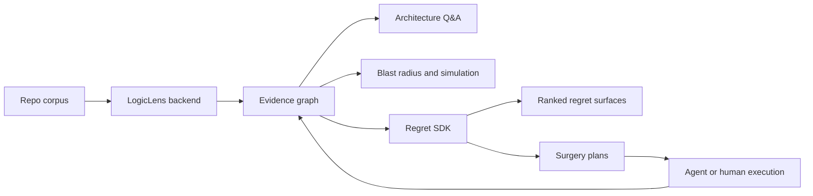

# Alignment And Trajectory - 2026-04-27

Purpose: reset the path from the current `heart-transplant` backend toward two connected products:

- a LogicLens-style backend that implements the paper-grade architecture we set out to build,
- a Regret SDK that uses that backend to find, explain, and remediate architectural regret.

## Current Position

We are not at private-beta product yet, but we do have a real backend spine:

- Tree-sitter ingest plus SCIP-backed identity for local repos.
- Durable structural artifacts and SurrealDB graph loading.
- A 24-block ontology and deterministic block classifier.
- MCP and CLI graph surfaces.
- Blast-radius, temporal, causal, regret, execution, and multimodal first passes.
- Gold benchmark files and dated trending-repo corpus input rails.

The sharp truth: the system is real enough to demo internally, but not honest enough yet for a self-serve beta launch. The remaining gaps are proof, coverage, and product contract gaps, not a lack of direction.

## North Star

The LogicLens backend should be the architectural intelligence substrate. It should ingest a repo, build a truthful multi-layer program graph, answer architecture questions with evidence, and expose traversal tools an agent can use without hallucinating structure.

The Regret SDK should be the product rail on top. It should detect accumulating architectural regret, explain why it matters, estimate blast radius and migration risk, and produce reviewable surgery plans that can become agent tasks.

The relationship is simple:

## What The LogicLens Backend Must Become

The backend should move from "artifact generator with useful graph tools" to "paper-grade architecture graph service."

Required capabilities:

- Structural truth: every code/file/test/API/infra node that can be targeted by an edge must be materialized and addressable.
- Semantic truth: block labels, summaries, entities, and actions must be benchmarked against holdout repos, not only generated.
- Retrieval truth: graph traversal must return scoped evidence with stable IDs, file ranges, and reasons.
- Temporal truth: historical snapshots must replay ingest over historical source, not infer architecture only from paths.
- Multimodal truth: test, OpenAPI, infra, and code layers must join on real nodes, not synthetic dangling IDs.
- Operator truth: CLI/MCP commands must run on a clean Windows checkout without private harnesses or encoding failures.

## What The Regret SDK Must Become

The SDK should not start as a generic "AI refactor planner." It should start as a narrow architecture-regret engine with receipts.

Required capabilities:

- Regret patterns: logging inconsistency, database sprawl, auth scattering, config leakage, queue/job sprawl, vendor lock-in, missing observability, and temporal drift.
- Evidence bundle: every regret needs affected nodes, graph path evidence, temporal evidence when available, and confidence.
- Surgery planner: every regret type needs a domain-correct remediation plan, not a generic template.
- Simulation: before recommending a change, estimate blast radius and likely collateral edits.
- Execution ledger: plans should produce auditable steps and validation commands, even before autonomous execution is trusted.
- SDK contract: stable JSON schemas and CLI/API methods that downstream agents can call.

## Immediate Trajectory

### Track 1: Beta Trust Rails

Goal: make local beta operation boring and reproducible.

Status: landed in `main`; now needs verification against the artifact we intend to ship.

- `run-hard-gates.ps1` / `run-hard-gates.cmd` no longer call a private absolute harness; they run in-repo `pytest`, `program-surface`, `validate-gates`, and `maximize-gates`.
- Ingest skips `.venv-win`, common virtualenv folders, VCS folders, and cache/build output directories.
- Windows console encoding for `simulate-change` is covered by the Phase 10 test path.
- Project status now treats older hard-gate pass claims as stale until regenerated by the repo-local shortcut.
- README no longer references a nonexistent `archive/legacy-prototype` path.

Exit criteria: run the landed trust rails on the shipping artifact and record the exact artifact/gold/holdout inputs that beta users should reproduce.

### Track 2: Block Benchmark Rails

Goal: prove semantic block quality separately from graph coverage.

- Promote the current benchmark readout into a `block-benchmark` CLI command.
- Report end-to-end accuracy, scorable accuracy, missing-node rate, multi-label recall, and per-block confusion.
- Clean contradictory gold rows in `clean-elysia`.
- Add file-level fallback or explicit `FileNode` block scoring for barrel/index files.
- Add daily-trending repos as a wider exploratory corpus, then graduate stable examples into gold.

Current baseline from `docs/evals/block-classification-benchmark-2026-04-27.md`: `72.7%` scorable holdout accuracy and `45.0%` missing-node rate. Exit criteria: at least `80%` scorable holdout accuracy, at most `15%` missing-node rate, and a reproducible report under `docs/evals/`.

### Track 3: Paper-Grade Graph Completion

Goal: remove dangling joins and path-only approximations.

- Materialize code-file nodes so Phase 13 cross-layer correlations target real graph nodes.
- Rebuild temporal snapshots by checking out historical commits and replaying Tree-sitter plus SCIP.
- Store snapshot lineage in graph form, not only report JSON.
- Add graph integrity gates for dangling edges, stale provisional IDs, and synthetic target leakage.

Exit criteria: multimodal and temporal claims survive graph integrity checks.

### Track 4: Regret SDK Contract

Goal: make regret detection a product, not just a CLI report.

- Define `RegretSurface`, `RegretEvidence`, `SurgeryPlan`, `SimulationResult`, and `ExecutionLedger` schemas.
- Fix regret-specific planner branches, starting with logging inconsistency.
- Add fixtures for known regrets with hidden labels.
- Gate every regret type on evidence relevance and plan specificity.
- Add a small SDK wrapper around the CLI so agents can run scans and consume JSON without shell parsing.

Exit criteria: an agent can call the SDK on a repo and receive ranked, typed, evidence-backed regrets with credible next actions.

## Private Beta Shape

The private beta should not promise "automatic architecture repair." It should promise:

- ingest your repo into a graph,
- label architectural blocks,
- answer graph-backed architecture questions,
- show likely blast radius,
- surface early regret candidates,
- export JSON evidence an agent can use.

The beta user gets architectural visibility and triage, not full autonomous migration. That is still valuable, and it is much safer to sell.

## Next Execution Queue

1. Run beta trust rails on the shipping artifact and publish the exact reproduction inputs.
2. Add `block-benchmark` CLI and commit the benchmark report.
3. Clean the holdout gold set and add multi-label support.
4. Materialize `codefile:` nodes and add a dangling-edge gate.
5. Fix logging-regret surgery planning.
6. Add daily-trending vendored inputs to the exploratory benchmark report.
7. Draft the first Regret SDK JSON schema document and test fixtures.

## Decision

The trajectory from here is not "more phases." It is tightening the rails around what already exists:

- LogicLens backend equals truthful graph plus measured semantic retrieval.
- Regret SDK equals productized regret detection on top of that graph.
- The beta launch becomes credible when the benchmark, gates, and operator path all agree.

The execution tranche that turns this alignment into measurable exits is
`docs/roadmaps/logiclens-next-tranche-2026-04-27.md`.
